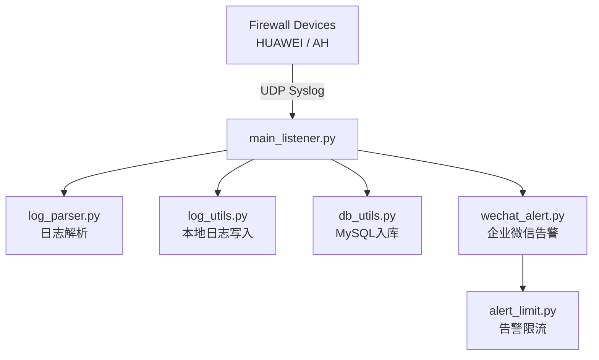

🔥 Firewall Log Collect System
📌 项目简介
本项目用于接收华为防火墙与安恒防火墙的 Syslog 日志，
实现：
日志监听
日志解析
本地存储
MySQL入库
企业微信告警
告警限流控制
适用于小型安全运维或 SOC 环境。

项目结构
fw_log_collect/
│
├── main_listener.py        # 程序入口，UDP监听核心
├── config.py               # 所有配置项
├── log_parser.py           # 日志解析模块（华为 + 安恒）
├── wechat_alert.py         # 企业微信告警模块
├── alert_limit.py          # 告警限流模块
├── db_utils.py             # 数据库连接 + 入库
├── log_utils.py            # 本地日志文件保存

各py文件的作用：
① config.py
集中管理：
监听IP
监听端口
数据库配置
企业微信Webhook
日志目录
日志过滤关键字

② log_parser.py
负责：
解析华为攻击日志
解析安恒 IPS
解析安恒 AV
解析扫描 / 洪泛 / 异常流量

③ db_utils.py
负责：
MySQL连接
校验表结构
执行 INSERT

④ wechat_alert.py
负责：
发送企业微信告警
根据设备选择模板
构建 Markdown 告警
调用企业微信 API
调用限流判断

⑤ alert_limit.py
负责：
生成限流 key
统计时间窗口
限制告警频率

⑥ log_utils.py
负责：
创建按天目录，把防火墙的日志接收到电脑C盘的ATTACK/raw目录里面，按天创建
写本地原始日志文件
支持 utf-8 / gbk 双编码

